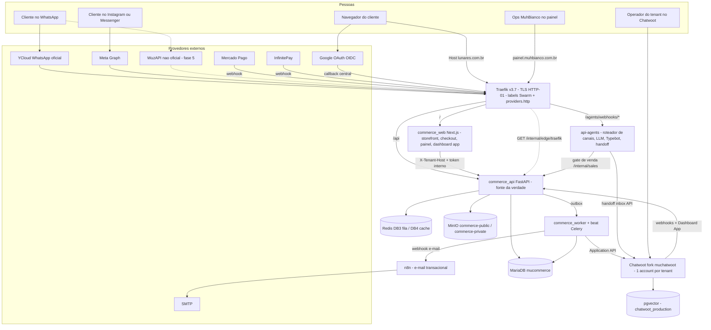
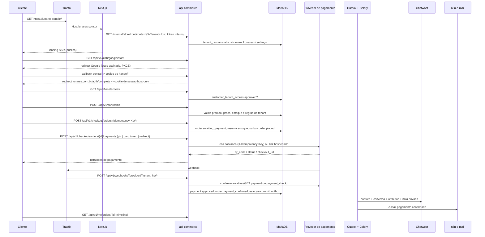
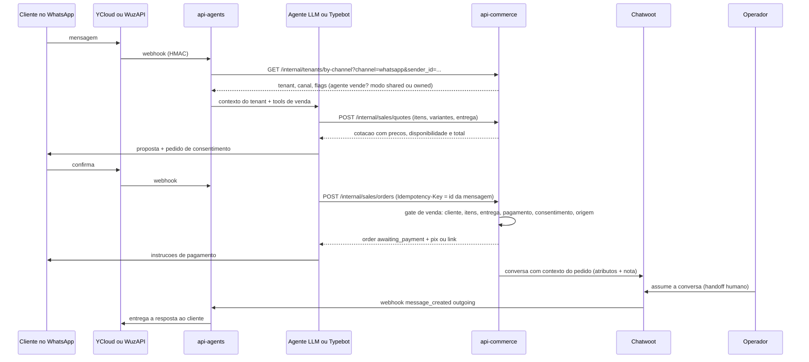
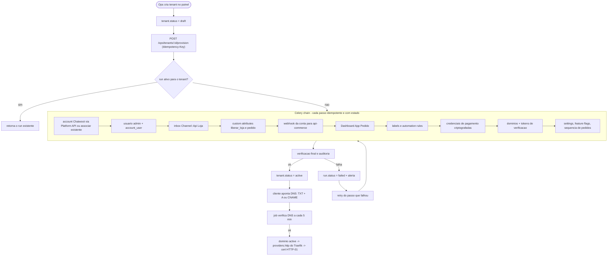
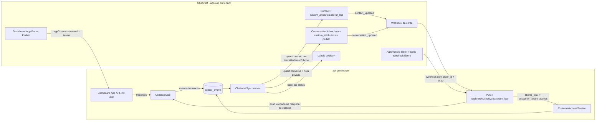

# C. Arquitetura e decisões técnicas

## 1. Topologia no hel1

Stack Swarm nova `commerce` na overlay `chatbot-net` (precisa falar com `chatwoot_rails`, `redis_redis`, `minio_minio`, `api-agents`). MariaDB continua no host (via `host.docker.internal`/IP da bridge, porta restrita).

| Serviço Swarm | Imagem | Papel | Recursos (limite) |
|---------------|--------|-------|-------------------|
| `commerce_api` | `muhrilobianco/commerce_api` | FastAPI (uvicorn, 2 workers) | 1 CPU / 512 MB |
| `commerce_worker` | mesma imagem | Celery `-Q commerce.default,commerce.payments,commerce.notifications,commerce.provisioning,commerce.media,commerce.outbox` | 0.5 CPU / 512 MB |
| `commerce_beat` | mesma imagem | Celery beat (relay do outbox, reconciliação, expirações, verificação de domínio) | 0.1 CPU / 128 MB |
| `commerce_web` | `muhrilobianco/commerce_web` | Next.js standalone (`node server.js`) | 0.5 CPU / 512 MB |
| `commerce_migrate` | `commerce_api` com `command: alembic upgrade head` | one-shot antes do `StackUpdate` (`restart_policy: none`) | efêmero |

Hosts Traefik (labels estáticas): `loja.muhbianco.com.br` → web; `painel.muhbianco.com.br` → web; `api-commerce.muhbianco.com.br` → api (webhooks, painel, callback OAuth, dashboard app API, `/internal` protegido por token). Hosts de tenant (dinâmicos) → web em `/` e api em `/api` via `providers.http`.

Redis: DB 3 = broker/result Celery da loja; DB 4 = cache, rate limit, locks. (0 = api-agents, 2 = Chatwoot.)

MinIO: buckets `commerce-public` (download anônimo, imagens de produto/logo/banner) e `commerce-private` (comprovantes, exportações; URL assinada). Prefixo `tenants/{tenant_id}/…` em ambos.

## 2. Diagramas

### 2.1 Visão de alto nível



### 2.2 Fluxo de compra no site



### 2.3 Pedido originado por agente ou WhatsApp



### 2.4 Provisionamento de tenant



### 2.5 Integração loja ↔ Chatwoot



## 3. Decisão 1 — Frontend: Next.js

- **App Router**, `output: "standalone"`, um container. Rotas: `app/(storefront)/…` (landing, catálogo, produto, carrinho, checkout, `me/*`), `app/(panel)/…` (painel do tenant e ops), `app/cw-app/…` (Dashboard App do Chatwoot), `app/auth/complete`.
- **Middleware** (`middleware.ts`): lê `host` (Traefik repassa `Host`), classifica: `painel.muhbianco.com.br` → painel; `api-commerce…` nunca chega aqui; qualquer outro host → storefront. Para storefront chama `GET http://commerce-api:8000/api/v1/internal/storefront/context` com `X-Tenant-Host` + `X-Internal-Token`, cacheado em memória por 60 s. Host desconhecido/inativo → página 404 neutra (sem revelar tenants). Aplica `storefront_access_mode` (redirect para `/entrar` ou `/acesso-pendente`).
- **SEO/OG por tenant**: `generateMetadata` usa `context.seo` (title, description, og_image em MinIO, favicon, canonical = domínio primário). Landing e catálogo em SSR com `revalidate` curto (60 s) por host (`unstable_cache` chaveado por tenant).
- **Chamadas do browser** sempre para o **mesmo host** (`/api/v1/*`, roteado pelo Traefik para a API) → cookies first-party, sem CORS no caminho principal. Server Components chamam a API internamente com `X-Tenant-Host` + `X-Internal-Token`.
- **Checkout**: SDK MP (`@mercadopago/sdk-react` Payment Brick ou Card Payment Brick) carregado com a `public_key` do tenant vinda do `context.payments`; o Brick devolve `token`, `payment_method_id`, `issuer_id`, `installments` → `POST /checkout/orders/{id}/payments`. Pix mostra `qr_code_base64` + copia-e-cola + polling de status (`GET /checkout/payments/{id}` a cada 3 s, com backoff) e fallback via SSE opcional. InfinitePay: `POST …/payments` devolve `checkout_url` → `window.location`; retorno em `/checkout/retorno?order=…` mostra estado real vindo da API (nunca confia na query string).
- **Painel**: mesmo app, host próprio, sessão de usuário administrativo (não cliente). RBAC vem do `GET /me` (memberships). Ops MuhBianco em `/ops/*`.
- **Implicações**: domínio custom funciona porque o Next só depende do `Host`; SEO server-side; landing sem page builder (blocos estruturados: hero, destaques, eventos, sobre, contato, políticas) renderizados de JSON validado por schema (Pydantic no backend, Zod no front).

## 4. Decisão 2 — Backend `api-commerce`

Convenções iguais às da `api-agents` (Settings pydantic-settings, `mysql+asyncmy`, `Base` com `NAMING_CONVENTION`, `UtcDateTime`, versionamento `/api/v1` + `/api/latest`, `RequestContextMiddleware` com `X-Request-ID`, JWT HS256/refresh opaco para painel), mais o que a loja exige:

```
apps/api-commerce/
  app/
    main.py                      # create_app, middlewares, mounts
    core/                        # config, database, security, scopes, rate_limit (Redis), crypto (AES-GCM envelope), logging (JSON), observability (Sentry, métricas)
    tenancy/                     # TenantContext, resolver (Host / X-Tenant-Host), dependency `current_tenant`, ORM filter (with_loader_criteria), domains, provisioning
    identity/                    # customers, identities (google), sessions (cookies), admin users, memberships, RBAC, access (liberar_loja)
    catalog/                     # products, variants, options/modifiers, categories, media, events
    inventory/                   # ledger, balances, reservations, adjustments
    manufacturing/               # suppliers, raw materials, lots, receipts, recipes, production orders, costing
    cart/                        # carts, items, quotes (PricingService)
    orders/                      # order aggregate, state machine, timeline, sales gate (single entry for all origins)
    payments/                    # PaymentProvider ABC, MercadoPagoProvider, InfinitePayProvider, FakeProvider, webhooks inbox, reconciliation, refunds
    fulfillment/                 # pickup/delivery, zones, scheduling
    notifications/               # templates per tenant, deliveries, n8n transport, resend
    chatwoot/                    # client (Platform + Application API), sync, webhook handler, dashboard-app API
    agents/                      # contracts for api-agents (tenant-by-channel, quotes, orders)
    integrations/                # credentials store, external ids, traefik edge config
    admin_provisioning/          # ops endpoints, runs/steps orchestration
    audit/                       # audit_log writer, outbox relay, processed_events
    api/v1/endpoints/…           # thin routers per module
    workers/                     # celery_app, tasks per queue, beat schedule
  migrations/versions/           # Alembic
  tests/                         # unit (SQLite), integration (MariaDB container), tenancy leak suite
```

- **Camadas**: Router → Service → Repository → Model. Serviços recebem `TenantContext` e `Actor` explícitos (nunca leem globals). Regras de preço/estoque/estado só em serviços.
- **ORM/migrations**: SQLAlchemy 2.0 async + Alembic (`compare_type`, `compare_server_default`, `render_as_batch=False`). Autogenerate revisado a mão; migrations numeradas `0001_…`. Nunca `Base.metadata.create_all` em prod.
- **Pydantic v2**: schemas de entrada estritos (`extra="forbid"`), dinheiro como `int` centavos, `Decimal` só em quantidades de insumo (`DECIMAL(18,6)`).
- **Testes**: `pytest` + `pytest-asyncio`; unit com SQLite em memória (como a `api-agents`); integração com MariaDB 10.11 em container (GitHub Actions service) para FKs compostas, locks e migrations; suíte de **vazamento multi-tenant** parametrizada; contratos de provider com `FakeProvider` e fixtures gravadas (respx) para MP/InfinitePay/Chatwoot.

## 5. Decisão 3 — Multi-tenancy

**Shared database / shared schema** com `tenant_id CHAR(36) NOT NULL` em toda tabela de negócio.

Por quê não database/schema por tenant no hel1: um MariaDB no host, dezenas de tenants pequenos, migrations únicas, backup único, sem custo de conexão por tenant. Extração futura de um tenant grande continua possível (`WHERE tenant_id = ?` → dump).

Reforço de isolamento em camadas:

1. **Borda**: Traefik só roteia hosts conhecidos (labels + provider dinâmico). Host desconhecido nem chega à aplicação.
2. **Contexto**: dependência `current_tenant` resolve a partir de `Host` (ou `X-Tenant-Host` + `X-Internal-Token`) e consulta `tenant_domains` com `status='active'` (cache Redis 60 s, invalidado por evento). Painel/ops: tenant vem do **path** (`/admin/tenants/{id}`) e é checado contra `memberships` do usuário.
3. **ORM**: mixin `TenantScoped`; listener `do_orm_execute` aplica `with_loader_criteria(TenantScoped, lambda cls: cls.tenant_id == session.info["tenant_id"])` em todo `SELECT`; `INSERT` recebe `tenant_id` do contexto via `before_flush`. Sessão sem `tenant_id` só é permitida em código marcado `@cross_tenant` (ops/jobs) e auditado.
4. **Banco**: FKs compostas `(tenant_id, parent_id)` em `order_items`, `cart_items`, `inventory_movements`, `payments`, `production_order_items`; unicidade sempre `(tenant_id, …)`.
5. **Testes**: `tests/tenancy/test_isolation.py` cria tenants A e B, popula tudo, e para cada rota autenticada afirma 404/lista vazia cruzando IDs.
6. **Mídia**: prefixo por tenant; URLs assinadas incluem o path completo; API valida `tenant_id` do objeto antes de assinar.

## 6. Decisão 8 — Domínios, resolução e TLS

**Modelo** (`tenant_domains`): `hostname` (IDNA/punycode, lowercase), `kind ∈ {platform_subdomain, custom_apex, custom_subdomain}`, `purpose ∈ {storefront, chat_redirect}`, `role ∈ {primary, alias}`, `status ∈ {pending_dns, verifying, verified, active, failed, disabled}`, `verification_token`, `verified_at`, `tls_status ∈ {none, requested, issued, error}`, `last_check_at`, `last_error`.

**Onboarding**:
1. Ops registra `lunares.com.br` (apex) e `www.lunares.com.br` (alias). O sistema gera `verification_token`.
2. Instruções mostradas no painel: TXT `_muhbianco-verify.lunares.com.br = mb-verify=<token>`; A `lunares.com.br → <IP hel1>`; CNAME `www → edge.muhbianco.com.br` (apex não aceita CNAME).
3. Job `verify_domains` (beat, 5 min, backoff até 48 h): resolve TXT, A/CNAME (via `dnspython`, resolvers públicos), compara com o IP do hel1. TXT ok → `verified`; A/CNAME ok → `active`.
4. `active` → entra no `GET /internal/edge/traefik` (JSON Traefik dynamic config: router `<hostname>-<hash8>` com `Host(\`lunares.com.br\`)`, `entryPoints: [websecure]`, `tls.certResolver: letsencryptresolver`, service `commerce_web`; router `…-api` com `Host(...) && PathPrefix(\`/api\`)` → `commerce_api`; middleware `redirectregex` dos aliases para o primário com 308). Traefik (`--providers.http.endpoint=http://commerce-api:8000/api/v1/internal/edge/traefik --providers.http.pollInterval=15s --providers.http.headers.X-Internal-Token=…`) puxa e pede o certificado HTTP-01 no primeiro acesso.
5. Job `check_tls` faz `GET https://<host>/healthz` e grava `tls_status`.

**Segurança**: Host header injection é neutralizada por (a) Traefik só rotear hosts configurados, (b) validação contra `tenant_domains` ativo, (c) nunca usar `Host` para montar links — links usam o domínio primário salvo. Domínio não verificado nunca entra no Traefik, então não pode apontar para tenant errado nem gerar tentativa ACME (rate limit LE: 50 certs/semana por domínio registrado; `edge.muhbianco.com.br` não emite cert por tenant, só o host final).

**Canônico e redirects**: apenas um `primary` por tenant e propósito; aliases fazem 308 (preserva método) para o primário. `www` vs apex é escolha do tenant. Subdomínio de plataforma `{slug}.loja.muhbianco.com.br` sempre existe como alias (fallback e pré-DNS).

**`chat.<tenant>`**: registrado como `purpose=chat_redirect`; o Next responde 302 para `https://chatwoot.muhbianco.com.br/app/accounts/{chatwoot_account_id}/dashboard`.

**Caddy vs Traefik**: Caddy on-demand TLS resolveria domínios dinâmicos nativamente, mas exigiria passthrough TCP `HostSNI(*)` no Traefik ou trocar a borda. Traefik + `providers.http` mantém a borda única e o processo de deploy atual. Reavaliar só se o número de domínios passar de centenas.

## 7. Decisão 4 — Jobs e fila

Celery 5 + Redis (DB 3), `acks_late=True`, `task_reject_on_worker_lost=True`, `visibility_timeout` compatível com a tarefa mais longa. Retry com backoff exponencial + jitter (`autoretry_for`, `retry_backoff=True`, `retry_jitter=True`, `max_retries` por classe). Toda tarefa recebe `tenant_id` e `correlation_id` explícitos e abre sessão com contexto do tenant.

Queues: `commerce.outbox` (relay), `commerce.payments` (webhooks, reconciliação, expiração), `commerce.notifications` (e-mail/Chatwoot), `commerce.provisioning` (Chatwoot Platform API, domínios), `commerce.media` (thumbnails), `commerce.default`.

Beat: `relay_outbox` (5 s), `reconcile_payments` (2 min, pagamentos `pending/requires_action` > 1 min), `expire_payments_and_reservations` (1 min), `verify_domains` (5 min), `check_tls` (30 min), `reconcile_chatwoot` (15 min), `inventory_balance_audit` (diário), `purge_expired_data` (diário).

## 8. Decisão 5 — Eventos de domínio e outbox

- Tabela `outbox_events(id, tenant_id, aggregate_type, aggregate_id, sequence, event_type, payload JSON, occurred_at, correlation_id, causation_id, status ∈ {pending, dispatched, processing, done, failed}, attempts, next_attempt_at, last_error)`, escrita **na mesma transação** do agregado.
- `relay_outbox` (beat, lock Redis) lê `pending` em ordem `(aggregate_type, aggregate_id, sequence)`, despacha uma task Celery por consumidor registrado para o `event_type` (`dispatch(event_id, consumer)`) e marca `dispatched`.
- Consumidores são idempotentes: `processed_events(consumer, event_id)` unique; ao processar, lêem o **estado atual** do agregado (não confiam só no payload) — eventos fora de ordem só coalescem.
- Falhas: `attempts++`, `next_attempt_at` com backoff; após `max_attempts` (8) → `failed` (DLQ na tabela) + alerta + botão "reprocessar" no painel ops.
- Catálogo de eventos (v1): `tenant.created`, `tenant.provisioning.completed|failed`, `tenant.activated|suspended`, `domain.verified|activated|failed`, `customer.created`, `customer.access.requested|approved|revoked`, `product.published|archived`, `inventory.low_stock`, `inventory.reservation.expired`, `order.placed`, `order.status_changed{from,to}`, `order.cancelled`, `payment.created|approved|rejected|expired|cancelled|refunded|chargeback`, `production.completed`, `notification.requested`, `chatwoot.sync.requested`.
- Consumidores v1: `ChatwootSync` (order.*, customer.access.*), `Notifier` (order.status_changed, payment.*), `InventoryCommitter` (payment.approved → commit reserva), `AuditProjector`, `AgentsNotifier` (fase 5: avisa `api-agents` para responder no canal).

## 9. Decisão 9 — Mídia (MinIO)

- Buckets: `commerce-public` (policy anônima de leitura em `tenants/*`), `commerce-private` (sem leitura anônima). Chaves: `tenants/{tenant_id}/products/{product_id}/{media_id}/{variant}.webp`, `tenants/{tenant_id}/brand/logo.svg`, `tenants/{tenant_id}/landing/{block_id}.webp`, `tenants/{tenant_id}/private/orders/{order_id}/…`.
- Upload: painel pede `POST /admin/tenants/{id}/media/uploads` → API valida tipo/tamanho, cria `media_assets(status=pending)` e devolve **URL assinada PUT** (TTL 10 min) para o `commerce-private/incoming/…`; após `POST …/media/{id}/complete`, task `process_media` valida (Pillow: formato real, dimensões, strip EXIF), gera `orig`, `1200`, `600`, `thumb` em WebP, grava no público e marca `ready`.
- Leitura pública via `https://storage.s3.muhbianco.com.br/commerce-public/...`; CDN (Cloudflare) na frente quando houver DNS lá. Privado via URL assinada GET (TTL 5 min) emitida pela API após checar tenant.
- Service account MinIO própria (`commerce`) com policy limitada aos dois buckets. Nunca as credenciais root.

## 10. Configuração, segredos e feature flags

- Env por ambiente (Portainer Env `${VAR}` desde o primeiro deploy — não repetir o padrão de secrets inline no Editor YAML). Chaves: DB (`DB_*`, usuário app), `MIGRATE_DB_*` só no one-shot, `REDIS_URL`, `CELERY_*`, `MINIO_*`, `INTERNAL_TOKEN`, `SESSION_SECRET`, `CREDENTIALS_MASTER_KEY` (32 bytes base64, Docker secret), `GOOGLE_CLIENT_ID/SECRET`, `CHATWOOT_BASE_URL`, `CHATWOOT_PLATFORM_TOKEN`, `EMAIL_WEBHOOK_URL/SECRET` (n8n), `EDGE_PUBLIC_IP`, `PLATFORM_BASE_DOMAIN=loja.muhbianco.com.br`.
- Por tenant: `tenant_settings` (JSON validado por schema versionado), `tenant_feature_flags(key, enabled, config)`: `storefront`, `manufacturing`, `events`, `delivery`, `pickup`, `payments.mercadopago`, `payments.infinitepay`, `chatwoot`, `sales_agent`, `whatsapp_owned`, `coupons`.
- Credenciais de integração: `tenant_integration_credentials(tenant_id, provider, key_name, ciphertext, nonce, key_version)` com AES-256-GCM (lib `cryptography`), AAD = `tenant_id:provider:key_name`. API só devolve `masked` + `configured_at`. Rotação: nova `key_version`, job re-encripta.

## 11. Contrato com a `api-agents`

| Direção | Endpoint | Auth | Uso |
|---------|----------|------|-----|
| agents → commerce | `GET /internal/tenants/by-channel?channel=whatsapp\|instagram\|messenger&sender_id=…` | `X-Internal-Token` (segredo dedicado `AGENTS_INTERNAL_TOKEN`) | descobre tenant, flags de venda, Chatwoot account/inbox do tenant |
| agents → commerce | `POST /internal/sales/quotes`, `POST /internal/sales/orders`, `GET /internal/sales/orders/{id}`, `POST /internal/customers/resolve` | idem + `Idempotency-Key` | gate de venda único |
| commerce → agents | `POST /api/latest/agents/internal/notify` (existente/novo) | token da api-agents | avisar cliente no canal sobre pagamento/status (fase 5) |
| commerce → agents | `POST /api/latest/agents/internal/phone-otp` | idem | OTP WhatsApp para vincular telefone (fase 1) |

Na `api-agents`, nasce `channel_tenant_bindings(channel, sender_id, tenant_key, chatwoot_account_id, chatwoot_inbox_id)` para o handoff cair na account do tenant (hoje é `CHATWOOT_ACCOUNT_ID` único).

## 12. Rate limiting, CORS e headers

- Rate limit Redis (token bucket) como dependência: por IP (público), por sessão/usuário, por tenant, por integração (webhooks por provider/tenant). Limites diferentes para `checkout` e `auth`.
- CORS: fechado por padrão; só `painel.muhbianco.com.br` para a API admin; storefront não precisa (mesmo host). Webhooks não usam CORS.
- CSRF: cookies `SameSite=Lax` + verificação `Origin`/`Sec-Fetch-Site` em mutações + header `X-Requested-With` exigido pelo cliente JS. Painel idem.
- Headers de segurança no Traefik (padrão das stacks atuais) + CSP no Next (permitindo `sdk.mercadopago.com`, `storage.s3.muhbianco.com.br`).
