# D. Modelo de dados

## 1. Convenções

| Tema | Decisão | Justificativa |
|------|---------|---------------|
| IDs | `CHAR(36)` UUIDv7 gerado na aplicação (`uuid6`/`uuid_utils`) | Ordenação temporal (clustering InnoDB razoável), mesma convenção `String(36)` da `api-agents`, sem expor contagem. MariaDB 10.11 tem tipo `UUID`, mas ele reordena bytes para v1 e a SQLAlchemy/asyncmy tratam melhor `CHAR(36)`. Inteiros só em `sequence`, contadores e tabelas de sistema. |
| Números humanos | `orders.order_number` (`LUN-000123`), `production_orders.number`, gerados por `tenant_sequences` com `SELECT … FOR UPDATE` | Cliente e operador falam em número curto; unicidade por tenant |
| Dinheiro | `BIGINT` em centavos + `currency CHAR(3)` (default `BRL`) na raiz do agregado (pedido/pagamento) | Sem erro de ponto flutuante; multi-moeda futura só exige `currency` por pedido |
| Quantidades | `DECIMAL(18,6)` para insumos e receitas; `INT` para itens de venda (unidade) e `DECIMAL(18,3)` quando `sold_by=weight` | Gramas/ml precisam de fração |
| Tempo | `DATETIME(6)` UTC (`UtcDateTime`); `tenant_settings.timezone` (default `America/Sao_Paulo`) para exibição e horário comercial | Sem ambiguidade; DST não afeta o Brasil hoje, mas timezone por tenant é barato |
| Tenant | `tenant_id CHAR(36) NOT NULL` em toda tabela de negócio; índices compostos começam por `tenant_id`; unicidade `(tenant_id, …)` | Isolamento e planos de consulta |
| FKs | `FOREIGN KEY` sempre; compostas `(tenant_id, parent_id)` nos agregados críticos | Impede referência cruzada entre tenants |
| Soft delete | Só em `products`, `product_variants`, `categories`, `raw_materials`, `recipes` (`archived_at`), porque pedidos/receitas históricas os referenciam. Tudo o mais é hard delete ou estado (`disabled`, `cancelled`) | Evita `WHERE deleted_at IS NULL` em toda query e mantém integridade histórica |
| Auditoria | `created_at`, `updated_at`, `created_by_actor`, `updated_by_actor` (`actor = type:id`, ex. `customer:uuid`, `admin:uuid`, `system:agent`, `chatwoot:agent_email`) + `audit_log` para ações críticas + `order_status_history` | Quem/quando/de onde em toda mudança relevante |
| Enums | `VARCHAR(32)` + CHECK/validação na aplicação (não `ENUM` MySQL) | Migração de estados sem `ALTER TABLE` bloqueante |
| JSON | `JSON` (LONGTEXT com CHECK no MariaDB) para settings, snapshots, payloads; sempre com schema Pydantic versionado (`schema_version`) | Flexibilidade controlada |
| Charset | `utf8mb4_0900_ai_ci`? não existe no MariaDB → `utf8mb4_unicode_520_ci` | Emojis em nomes de produto e mensagens |

## 2. Entidades por módulo (campos essenciais)

Todas as tabelas abaixo têm `id`, `tenant_id` (exceto as marcadas **global**), `created_at`, `updated_at`; omitidos por brevidade.

### tenancy
- **tenants** (global): `slug` UNIQUE, `name`, `legal_name`, `document` (CNPJ/CPF), `status ∈ draft|provisioning|active|suspended|archived`, `plan`, `public_key` (identificador opaco em URLs de webhook, UNIQUE), `default_currency`, `timezone`, `locale`, `activated_at`.
- **tenant_settings**: `key` (namespace: `branding`, `landing`, `seo`, `storefront`, `fulfillment`, `business_hours`, `policies`, `notifications`, `checkout`), `value JSON`, `schema_version`; UNIQUE `(tenant_id, key)`.
- **tenant_feature_flags**: `key`, `enabled`, `config JSON`; UNIQUE `(tenant_id, key)`.
- **tenant_domains**: ver [02 §6](02-arquitetura.md); UNIQUE `hostname` (global — um host pertence a um único tenant), índice `(tenant_id, purpose, role)`.
- **tenant_sequences**: `name`, `next_value`; UNIQUE `(tenant_id, name)`.
- **tenant_provisioning_runs**: `kind ∈ activate|reprovision|deactivate`, `status ∈ requested|running|completed|failed|aborted`, `idempotency_key`, `requested_by`, `started_at`, `finished_at`, `summary JSON`.
- **tenant_provisioning_steps**: `run_id`, `name`, `order`, `status ∈ pending|running|done|failed|skipped`, `attempts`, `external_ref`, `last_error`, `started_at`, `finished_at`.

### identity
- **customers** (global): `email_normalized` UNIQUE nullable, `email_verified_at`, `phone_e164` nullable, `phone_verified_at`, `full_name`, `document` nullable (criptografado), `status ∈ active|blocked|anonymized`, `anonymized_at`.
- **customer_identities** (global): `customer_id`, `provider ∈ google|phone_otp`, `subject` (Google `sub`), `email_at_provider`, `raw_claims JSON` (mínimo), `last_login_at`; UNIQUE `(provider, subject)`.
- **customer_sessions** (global, ou Redis): `customer_id`, `tenant_id`, `token_hash`, `expires_at`, `revoked_at`, `ip`, `user_agent`.
- **customer_tenant_access**: `customer_id`, `status ∈ pending|approved|blocked|revoked`, `source ∈ chatwoot|panel|auto|import`, `chatwoot_contact_id`, `approved_by_actor`, `approved_at`, `note`; UNIQUE `(tenant_id, customer_id)`.
- **customer_channel_links**: `customer_id`, `channel ∈ whatsapp|instagram|messenger`, `external_id` (E.164/PSID/IGSID), `verified_at`; UNIQUE `(tenant_id, channel, external_id)`.
- **admin_users** (global): `email` UNIQUE, `full_name`, `google_subject`, `password_hash` nullable, `is_platform_admin`, `status`.
- **tenant_memberships**: `admin_user_id`, `role ∈ owner|admin|ops|support`, `status`; UNIQUE `(tenant_id, admin_user_id)`.
- **admin_refresh_tokens** (global): como na `api-agents`.
- **consents**: `customer_id`, `kind ∈ terms|privacy|marketing|order_terms`, `document_version_id`, `accepted_at`, `ip`, `user_agent`, `channel`, `evidence_ref` (id da mensagem no canal).
- **legal_documents**: `kind`, `version`, `content_url`/`content_md`, `published_at`; UNIQUE `(tenant_id, kind, version)`.

### catalog
- **categories**: `parent_id` nullable, `slug`, `name`, `position`, `archived_at`; UNIQUE `(tenant_id, slug)`.
- **products**: `sku`, `slug`, `name`, `short_description`, `description_md`, `kind ∈ physical|made_to_order|service|digital|ticket`, `status ∈ draft|active|inactive|sold_out|archived`, `base_price_cents`, `promo_price_cents` nullable, `promo_starts_at/ends_at`, `cost_cents_estimate`, `stock_policy ∈ tracked|untracked|made_to_order|unlimited`, `sold_by ∈ unit|weight`, `unit_label`, `weight_grams`, `width_mm/height_mm/depth_mm`, `lead_time_hours`, `daily_capacity`, `position`, `seo JSON`, `published_at`, `archived_at`, `has_variants`; UNIQUE `(tenant_id, sku)`, `(tenant_id, slug)`; índice `(tenant_id, status, position)`.
- **product_categories**: `(tenant_id, product_id, category_id)` PK.
- **product_tags**: `product_id`, `tag`; índice `(tenant_id, tag)`.
- **product_options**: `product_id`, `name` (Tamanho), `position`; **product_option_values**: `option_id`, `value` (P/M/G), `position`.
- **product_variants**: `product_id`, `sku`, `name`, `option_values JSON` (`{"Tamanho":"M"}`), `price_cents` nullable (herda), `cost_cents` nullable, `stock_policy` nullable (herda), `media_id` nullable, `status`, `position`, `archived_at`; UNIQUE `(tenant_id, sku)`; `default_variant` implícita quando `has_variants=false` (sempre existe 1 variante — simplifica estoque e pedido).
- **product_modifier_groups**: `product_id`, `name` (Cobertura), `min_select`, `max_select`, `required`; **product_modifiers**: `group_id`, `name`, `price_delta_cents`, `sku` nullable, `stock_variant_id` nullable (baixa estoque de outro item), `position`.
- **product_bundles** (fase 6): `bundle_product_id`, `component_variant_id`, `qty`.
- **media_assets**: `owner_type ∈ product|variant|tenant_brand|landing|event`, `owner_id`, `bucket`, `object_key`, `mime`, `bytes`, `width`, `height`, `variants JSON`, `alt`, `position`, `status ∈ pending|processing|ready|failed`, `checksum_sha256`.
- **events**: `slug`, `name`, `description_md`, `media_id`, `starts_at`, `ends_at`, `sales_open_at`, `sales_close_at`, `status ∈ draft|published|closed|cancelled`, `capacity` nullable, `capacity_used`, `featured`, `location JSON`; UNIQUE `(tenant_id, slug)`.
- **event_products**: `event_id`, `product_id`, `position`, `event_price_cents` nullable.

### inventory
- **inventory_items** (view lógica): item = `product_variant` ou `raw_material`. Tabelas físicas:
- **inventory_balances**: `item_type ∈ variant|raw_material`, `item_id`, `on_hand DECIMAL(18,6)`, `reserved DECIMAL(18,6)`, `unit`, `min_level`, `updated_at`; UNIQUE `(tenant_id, item_type, item_id)`. `available = on_hand - reserved` (calculado).
- **inventory_movements** (ledger, append-only): `item_type`, `item_id`, `movement_type ∈ purchase_in|production_in|production_out|sale_commit|sale_return|adjustment|loss|expiry|count|transfer_in|transfer_out|initial`, `qty` (assinado), `unit`, `unit_cost_cents` nullable, `total_cost_cents` nullable, `lot_id` nullable, `reference_type` (`order`, `production_order`, `receipt`, `adjustment`), `reference_id`, `reason`, `note`, `actor`, `occurred_at`, `balance_after`; índice `(tenant_id, item_type, item_id, occurred_at)`, `(tenant_id, reference_type, reference_id)`.
- **inventory_reservations**: `variant_id`, `order_id`, `qty`, `status ∈ active|committed|released|expired`, `expires_at`, `released_reason`; índice `(tenant_id, status, expires_at)`; UNIQUE `(tenant_id, order_id, variant_id)`.
- **stock_adjustments**: cabeçalho de ajuste manual com `reason ∈ count|loss|damage|correction|other`, `note`, `actor`; movimentos referenciam.

### manufacturing
- **suppliers**: `name`, `document`, `contact JSON`, `archived_at`.
- **raw_materials**: `code`, `name`, `unit ∈ g|kg|ml|l|un|pct|cx` (base de estoque), `purchase_unit`, `purchase_to_base_factor DECIMAL(18,6)`, `min_level`, `avg_cost_cents_per_unit` (custo médio móvel, em centavos por unidade base ×10^4 para precisão → `avg_cost_micro` BIGINT em 1/10.000 de centavo), `track_lots`, `archived_at`; UNIQUE `(tenant_id, code)`.
- **raw_material_lots**: `raw_material_id`, `lot_code`, `expires_at`, `qty_remaining`, `unit_cost_micro`, `receipt_id`.
- **raw_material_receipts** (entrada): `supplier_id`, `raw_material_id`, `qty`, `unit`, `total_cost_cents`, `unit_cost_micro` (calculado), `lot_id` nullable, `document_ref`, `document_media_id`, `received_at`, `actor`. Gera `inventory_movements(purchase_in)` e atualiza custo médio.
- **recipes** (ficha técnica): `product_id`, `variant_id` nullable, `version`, `yield_qty`, `yield_unit`, `expected_loss_pct`, `status ∈ draft|active|archived`, `theoretical_cost_cents` (cache), `notes`; UNIQUE `(tenant_id, product_id, variant_id, version)`.
- **recipe_items**: `recipe_id`, `raw_material_id`, `qty_per_yield`, `unit`, `loss_pct`.
- **production_orders**: `number`, `product_id`, `variant_id`, `recipe_id`, `recipe_version`, `planned_qty`, `produced_qty`, `status ∈ draft|planned|in_progress|completed|partially_completed|cancelled`, `planned_cost_cents`, `actual_cost_cents`, `responsible_actor`, `started_at`, `finished_at`, `notes`.
- **production_order_consumptions**: `production_order_id`, `raw_material_id`, `planned_qty`, `actual_qty`, `lot_id` nullable, `unit_cost_micro_snapshot`, `waste_qty`.
- **product_cost_snapshots**: `variant_id`, `cost_cents`, `source ∈ recipe_theoretical|production_actual|purchase_avg|manual`, `effective_from`; índice `(tenant_id, variant_id, effective_from)`.

### cart e orders
- **carts**: `customer_id` nullable (visitante só se `access_mode=public`), `session_id`, `status ∈ active|converted|abandoned|expired`, `currency`, `fulfillment JSON` (modo, endereço, janela), `coupon_code`, `notes`, `last_activity_at`, `converted_order_id`; índice `(tenant_id, customer_id, status)`.
- **cart_items**: `cart_id`, `variant_id`, `qty`, `modifiers JSON` (ids + snapshot de nome/delta), `unit_price_cents_snapshot` (informativo; recalculado no checkout), `event_id` nullable; FK composta `(tenant_id, cart_id)`.
- **orders**: `order_number`, `customer_id`, `status`, `origin ∈ web|whatsapp_ycloud|whatsapp_wuzapi|instagram|messenger|agent_llm|typebot|operator|admin`, `channel_refs JSON` (conversation_id, contact_id, message_id, sender_id), `currency`, `subtotal_cents`, `discount_cents`, `shipping_fee_cents`, `total_cents`, `coupon_id` nullable, `fulfillment_type ∈ pickup|delivery`, `customer_snapshot JSON` (nome, e-mail, telefone, documento mascarado), `notes_customer`, `notes_internal`, `event_id` nullable, `terms_consent_id`, `placed_at`, `paid_at`, `accepted_at`, `completed_at`, `cancelled_at`, `cancel_reason`, `cancelled_by_actor`, `idempotency_key`, `risk_flags JSON`, `tax_document_ref`, `version` (optimistic lock); UNIQUE `(tenant_id, order_number)`, `(tenant_id, idempotency_key)`; índices `(tenant_id, customer_id, placed_at)`, `(tenant_id, status, placed_at)`.
- **order_items**: `order_id`, `variant_id`, `product_name_snapshot`, `variant_name_snapshot`, `sku_snapshot`, `qty`, `unit_price_cents`, `modifiers JSON` (snapshot), `modifiers_total_cents`, `line_total_cents`, `unit_cost_cents_snapshot` nullable, `event_id`; FK composta `(tenant_id, order_id)`.
- **order_status_history**: `order_id`, `from_status`, `to_status`, `actor`, `reason`, `source ∈ system|customer|operator|chatwoot|agent|webhook`, `metadata JSON`, `occurred_at`.
- **order_timeline** (visão para o cliente/operador; pode ser view sobre history + payments + notifications).
- **addresses**: `customer_id`, `label`, `recipient_name`, `postal_code`, `street`, `number`, `complement`, `district`, `city`, `state`, `ibge_city_code`, `country='BR'`, `reference`, `is_default`.
- **fulfillments**: `order_id`, `type`, `status ∈ pending|scheduled|ready|out_for_delivery|delivered|picked_up|failed|cancelled`, `address_snapshot JSON`, `pickup_location_id`, `scheduled_window_start/end`, `carrier`, `tracking_code`, `delivered_at`, `proof_media_id`.
- **coupons** (fase 3+): `code`, `kind ∈ percent|fixed`, `value`, `min_order_cents`, `starts_at`, `ends_at`, `max_redemptions`, `per_customer_limit`, `status`; UNIQUE `(tenant_id, code)`; **coupon_redemptions**: `coupon_id`, `order_id`, `customer_id`.

### payments
- **tenant_payment_configs**: `provider ∈ mercadopago|infinitepay|fake`, `enabled`, `is_default`, `mode ∈ embedded|redirect`, `public_config JSON` (public_key MP; handle InfinitePay), `capabilities JSON` (pix, credit, debit, installments_max), `webhook_secret_ref`, `sandbox`; UNIQUE `(tenant_id, provider)`.
- **tenant_integration_credentials**: `provider`, `key_name`, `ciphertext BLOB`, `nonce`, `key_version`, `masked`, `rotated_at`; UNIQUE `(tenant_id, provider, key_name)`.
- **payments**: `order_id`, `provider`, `mode`, `method ∈ pix|credit_card|debit_card|boleto|redirect`, `status`, `amount_cents`, `paid_amount_cents`, `installments`, `provider_payment_id`, `provider_reference` (`order_nsu`/`external_reference`), `provider_status`, `idempotency_key`, `pix_qr_code`, `pix_qr_code_base64_ref`, `pix_copy_paste`, `checkout_url`, `expires_at`, `approved_at`, `failure_code`, `failure_message`, `payer_snapshot JSON` (e-mail, nome, doc mascarado, last4/brand), `raw_provider_summary JSON` (mínimo auditável), `reconciled_at`; UNIQUE `(tenant_id, idempotency_key)`, `(provider, provider_payment_id)`; índice `(tenant_id, status, expires_at)`.
- **payment_attempts**: `payment_id`, `attempt_no`, `request_summary JSON`, `response_summary JSON`, `http_status`, `error`, `duration_ms`.
- **payment_webhook_inbox**: `provider`, `tenant_id` nullable (resolvido do path), `payment_id` nullable, `external_event_id` (MP `id`/`x-request-id`; InfinitePay `transaction_nsu`), `signature_valid`, `headers JSON`, `body JSON`, `received_at`, `processed_at`, `result ∈ processed|duplicate|ignored|invalid|failed`, `error`; UNIQUE `(provider, external_event_id)`.
- **refunds**: `payment_id`, `order_id`, `amount_cents`, `reason`, `status ∈ requested|approved|processing|completed|failed|rejected`, `method ∈ provider|external`, `provider_refund_id`, `requested_by_actor`, `approved_by_actor`, `external_evidence_media_id`, `completed_at`.

### notifications
- **notification_templates**: `channel ∈ email|whatsapp|chatwoot_note`, `event_key` (`order.payment_confirmed`…), `locale`, `subject_tpl`, `body_tpl` (Jinja2 sandbox), `enabled`, `version`; UNIQUE `(tenant_id, channel, event_key, locale)`; fallback para templates globais (`tenant_id` = tenant `platform`).
- **notification_deliveries**: `event_id` (outbox), `template_id`, `channel`, `recipient`, `status ∈ queued|sent|failed|skipped`, `attempts`, `provider_message_id`, `rendered_subject`, `rendered_body_ref`, `last_error`, `sent_at`; UNIQUE `(tenant_id, event_id, channel, recipient)` (idempotência de envio).

### chatwoot e integrações
- **tenant_chatwoot_accounts**: `chatwoot_account_id` UNIQUE, `account_api_token_ref` (credencial), `platform_managed`, `admin_user_email`, `webhook_id`, `webhook_secret_ref`, `dashboard_app_id`, `dashboard_app_token_ref`, `attribute_defs JSON` (ids criados), `labels JSON`, `status`.
- **tenant_chatwoot_inboxes**: `chatwoot_inbox_id`, `purpose ∈ store|whatsapp|instagram|messenger`, `channel_type`, `identifier`, `hmac_token_ref`; UNIQUE `(tenant_id, purpose)`.
- **customer_chatwoot_contacts**: `customer_id`, `chatwoot_contact_id`, `last_synced_at`, `last_synced_hash`; UNIQUE `(tenant_id, customer_id)`, `(tenant_id, chatwoot_contact_id)`.
- **order_chatwoot_conversations**: `order_id`, `chatwoot_conversation_id`, `inbox_id`, `last_synced_status`, `last_synced_at`; UNIQUE `(tenant_id, order_id)`.
- **chatwoot_webhook_inbox**: `tenant_id`, `event`, `chatwoot_event_id`/hash do corpo, `body JSON`, `signature_valid`, `received_at`, `processed_at`, `result`; UNIQUE `(tenant_id, body_hash)`.
- **sales_channels**: `channel ∈ web|whatsapp|instagram|messenger|agent`, `enabled`, `sender_id` (phone_number_id/page_id/ig_id), `provider ∈ ycloud|wuzapi|meta`, `config JSON`; UNIQUE `(channel, sender_id)` global (um número pertence a um tenant).
- **webhook_deliveries** (saída, ex.: n8n, api-agents): `target`, `event_id`, `url`, `status`, `attempts`, `response_status`, `last_error`, `next_attempt_at`.

### plataforma
- **outbox_events**, **processed_events** (`consumer`, `event_id`, `processed_at`; UNIQUE), **idempotency_keys** (`scope` (`checkout`, `sales`, `payments`, `provisioning`), `tenant_id`, `key`, `request_hash`, `response_status`, `response_body JSON`, `expires_at`; UNIQUE `(scope, tenant_id, key)`), **audit_log** (`tenant_id` nullable, `actor`, `action`, `entity_type`, `entity_id`, `before JSON`, `after JSON`, `ip`, `user_agent`, `request_id`, `occurred_at`; índice `(tenant_id, entity_type, entity_id, occurred_at)`), **jobs** (`kind`, `status`, `payload`, `result`, `attempts`, `scheduled_at`, `locked_by`) para processos longos com acompanhamento no painel (exportações, reprocessamentos).

## 3. Relacionamentos principais

```mermaid
erDiagram
  TENANTS ||--o{ TENANT_DOMAINS : owns
  TENANTS ||--o{ TENANT_SETTINGS : has
  TENANTS ||--o{ TENANT_FEATURE_FLAGS : has
  TENANTS ||--|| TENANT_CHATWOOT_ACCOUNTS : maps
  TENANTS ||--o{ TENANT_PAYMENT_CONFIGS : configures
  TENANTS ||--o{ PRODUCTS : sells
  PRODUCTS ||--|{ PRODUCT_VARIANTS : has
  PRODUCTS }o--o{ CATEGORIES : in
  PRODUCTS ||--o{ PRODUCT_MODIFIER_GROUPS : offers
  PRODUCT_VARIANTS ||--|| INVENTORY_BALANCES : stocked_as
  INVENTORY_BALANCES ||--o{ INVENTORY_MOVEMENTS : ledger
  PRODUCT_VARIANTS ||--o{ INVENTORY_RESERVATIONS : reserved
  CUSTOMERS ||--o{ CUSTOMER_IDENTITIES : logs_in_with
  CUSTOMERS ||--o{ CUSTOMER_TENANT_ACCESS : allowed_in
  TENANTS ||--o{ CUSTOMER_TENANT_ACCESS : grants
  CUSTOMERS ||--o{ CARTS : has
  CARTS ||--o{ CART_ITEMS : contains
  CUSTOMERS ||--o{ ORDERS : places
  ORDERS ||--|{ ORDER_ITEMS : contains
  ORDERS ||--o{ ORDER_STATUS_HISTORY : transitions
  ORDERS ||--o{ PAYMENTS : paid_by
  PAYMENTS ||--o{ PAYMENT_ATTEMPTS : tries
  PAYMENTS ||--o{ REFUNDS : refunded_by
  ORDERS ||--|| FULFILLMENTS : delivered_by
  ORDERS ||--o| ORDER_CHATWOOT_CONVERSATIONS : mirrored_in
  CUSTOMERS ||--o{ CUSTOMER_CHATWOOT_CONTACTS : mirrored_as
  EVENTS ||--o{ EVENT_PRODUCTS : sells
  RAW_MATERIALS ||--o{ RAW_MATERIAL_RECEIPTS : received
  RAW_MATERIALS ||--o{ RECIPE_ITEMS : used_in
  RECIPES ||--|{ RECIPE_ITEMS : composed_of
  PRODUCTS ||--o{ RECIPES : made_by
  RECIPES ||--o{ PRODUCTION_ORDERS : executed_as
  PRODUCTION_ORDERS ||--|{ PRODUCTION_ORDER_CONSUMPTIONS : consumes
  TENANTS ||--o{ OUTBOX_EVENTS : emits
  TENANTS ||--o{ TENANT_PROVISIONING_RUNS : provisioned_by
  TENANT_PROVISIONING_RUNS ||--|{ TENANT_PROVISIONING_STEPS : steps
```



## 4. Índices críticos e unicidades

| Tabela | Índice/Unique | Motivo |
|--------|---------------|--------|
| tenant_domains | UNIQUE(hostname) | resolução O(1) por Host, um host = um tenant |
| tenant_domains | (tenant_id, purpose, role) | achar primário/aliases |
| products | UNIQUE(tenant_id, sku), UNIQUE(tenant_id, slug), (tenant_id, status, position) | catálogo e vitrine |
| product_variants | UNIQUE(tenant_id, sku), (tenant_id, product_id, position) | |
| inventory_balances | UNIQUE(tenant_id, item_type, item_id) | lock de linha por item |
| inventory_movements | (tenant_id, item_type, item_id, occurred_at), (tenant_id, reference_type, reference_id) | extrato e rastreio por pedido |
| inventory_reservations | (tenant_id, status, expires_at), UNIQUE(tenant_id, order_id, variant_id) | expiração e idempotência |
| orders | UNIQUE(tenant_id, order_number), UNIQUE(tenant_id, idempotency_key), (tenant_id, customer_id, placed_at DESC), (tenant_id, status, placed_at) | meus pedidos, fila operacional |
| payments | UNIQUE(tenant_id, idempotency_key), UNIQUE(provider, provider_payment_id), (tenant_id, status, expires_at), (provider, provider_reference) | webhooks e expiração |
| payment_webhook_inbox | UNIQUE(provider, external_event_id) | dedupe de entrega |
| customer_tenant_access | UNIQUE(tenant_id, customer_id), (tenant_id, status) | gate de acesso |
| customers | UNIQUE(email_normalized), (phone_e164) | conciliação |
| customer_identities | UNIQUE(provider, subject) | login |
| outbox_events | (status, next_attempt_at), (aggregate_type, aggregate_id, sequence) | relay ordenado |
| processed_events | UNIQUE(consumer, event_id) | idempotência do consumidor |
| idempotency_keys | UNIQUE(scope, tenant_id, key) | replays de checkout/agente |
| audit_log | (tenant_id, entity_type, entity_id, occurred_at) | trilha |
| sales_channels | UNIQUE(channel, sender_id) | um número/página por tenant |

## 5. DDL inicial simplificado (tabelas mais importantes)

```sql
CREATE TABLE tenants (
  id CHAR(36) PRIMARY KEY,
  slug VARCHAR(63) NOT NULL UNIQUE,
  public_key CHAR(32) NOT NULL UNIQUE,
  name VARCHAR(160) NOT NULL,
  legal_name VARCHAR(200) NULL,
  document VARCHAR(20) NULL,
  status VARCHAR(32) NOT NULL DEFAULT 'draft',
  default_currency CHAR(3) NOT NULL DEFAULT 'BRL',
  timezone VARCHAR(64) NOT NULL DEFAULT 'America/Sao_Paulo',
  locale VARCHAR(10) NOT NULL DEFAULT 'pt-BR',
  activated_at DATETIME(6) NULL,
  created_at DATETIME(6) NOT NULL, updated_at DATETIME(6) NOT NULL
) ENGINE=InnoDB DEFAULT CHARSET=utf8mb4 COLLATE=utf8mb4_unicode_520_ci;

CREATE TABLE tenant_domains (
  id CHAR(36) PRIMARY KEY,
  tenant_id CHAR(36) NOT NULL,
  hostname VARCHAR(253) NOT NULL UNIQUE,
  kind VARCHAR(32) NOT NULL,        -- platform_subdomain | custom_apex | custom_subdomain
  purpose VARCHAR(32) NOT NULL,     -- storefront | chat_redirect
  role VARCHAR(16) NOT NULL,        -- primary | alias
  status VARCHAR(32) NOT NULL DEFAULT 'pending_dns',
  verification_token CHAR(43) NOT NULL,
  verified_at DATETIME(6) NULL,
  tls_status VARCHAR(16) NOT NULL DEFAULT 'none',
  last_check_at DATETIME(6) NULL, last_error VARCHAR(500) NULL,
  created_at DATETIME(6) NOT NULL, updated_at DATETIME(6) NOT NULL,
  CONSTRAINT fk_tenant_domains_tenant FOREIGN KEY (tenant_id) REFERENCES tenants(id),
  KEY ix_tenant_domains_tenant_purpose_role (tenant_id, purpose, role)
);

CREATE TABLE customers (
  id CHAR(36) PRIMARY KEY,
  email_normalized VARCHAR(320) NULL UNIQUE,
  email_verified_at DATETIME(6) NULL,
  phone_e164 VARCHAR(20) NULL,
  phone_verified_at DATETIME(6) NULL,
  full_name VARCHAR(200) NULL,
  document_enc VARBINARY(256) NULL,
  status VARCHAR(16) NOT NULL DEFAULT 'active',
  anonymized_at DATETIME(6) NULL,
  created_at DATETIME(6) NOT NULL, updated_at DATETIME(6) NOT NULL,
  KEY ix_customers_phone (phone_e164)
);

CREATE TABLE customer_identities (
  id CHAR(36) PRIMARY KEY,
  customer_id CHAR(36) NOT NULL,
  provider VARCHAR(32) NOT NULL,
  subject VARCHAR(255) NOT NULL,
  email_at_provider VARCHAR(320) NULL,
  last_login_at DATETIME(6) NULL,
  created_at DATETIME(6) NOT NULL, updated_at DATETIME(6) NOT NULL,
  UNIQUE KEY uq_identity (provider, subject),
  CONSTRAINT fk_identity_customer FOREIGN KEY (customer_id) REFERENCES customers(id)
);

CREATE TABLE customer_tenant_access (
  id CHAR(36) PRIMARY KEY,
  tenant_id CHAR(36) NOT NULL,
  customer_id CHAR(36) NOT NULL,
  status VARCHAR(16) NOT NULL DEFAULT 'pending',   -- pending | approved | blocked | revoked
  source VARCHAR(16) NOT NULL,                      -- chatwoot | panel | auto | import
  chatwoot_contact_id BIGINT NULL,
  approved_by_actor VARCHAR(120) NULL, approved_at DATETIME(6) NULL,
  note VARCHAR(500) NULL,
  created_at DATETIME(6) NOT NULL, updated_at DATETIME(6) NOT NULL,
  UNIQUE KEY uq_cta (tenant_id, customer_id),
  KEY ix_cta_status (tenant_id, status),
  CONSTRAINT fk_cta_tenant FOREIGN KEY (tenant_id) REFERENCES tenants(id),
  CONSTRAINT fk_cta_customer FOREIGN KEY (customer_id) REFERENCES customers(id)
);

CREATE TABLE products (
  id CHAR(36) PRIMARY KEY,
  tenant_id CHAR(36) NOT NULL,
  sku VARCHAR(64) NOT NULL, slug VARCHAR(160) NOT NULL,
  name VARCHAR(200) NOT NULL,
  short_description VARCHAR(500) NULL, description_md MEDIUMTEXT NULL,
  kind VARCHAR(16) NOT NULL DEFAULT 'physical',
  status VARCHAR(16) NOT NULL DEFAULT 'draft',
  base_price_cents BIGINT NOT NULL,
  promo_price_cents BIGINT NULL, promo_starts_at DATETIME(6) NULL, promo_ends_at DATETIME(6) NULL,
  cost_cents_estimate BIGINT NULL,
  stock_policy VARCHAR(16) NOT NULL DEFAULT 'tracked',
  sold_by VARCHAR(8) NOT NULL DEFAULT 'unit', unit_label VARCHAR(16) NOT NULL DEFAULT 'un',
  weight_grams INT NULL, width_mm INT NULL, height_mm INT NULL, depth_mm INT NULL,
  lead_time_hours INT NULL, daily_capacity INT NULL,
  has_variants TINYINT(1) NOT NULL DEFAULT 0,
  position INT NOT NULL DEFAULT 0,
  seo JSON NULL,
  published_at DATETIME(6) NULL, archived_at DATETIME(6) NULL,
  created_by_actor VARCHAR(120) NOT NULL, updated_by_actor VARCHAR(120) NOT NULL,
  created_at DATETIME(6) NOT NULL, updated_at DATETIME(6) NOT NULL,
  UNIQUE KEY uq_products_sku (tenant_id, sku),
  UNIQUE KEY uq_products_slug (tenant_id, slug),
  KEY ix_products_status (tenant_id, status, position),
  CONSTRAINT fk_products_tenant FOREIGN KEY (tenant_id) REFERENCES tenants(id)
);

CREATE TABLE product_variants (
  id CHAR(36) PRIMARY KEY,
  tenant_id CHAR(36) NOT NULL,
  product_id CHAR(36) NOT NULL,
  sku VARCHAR(64) NOT NULL, name VARCHAR(200) NOT NULL,
  option_values JSON NULL,
  price_cents BIGINT NULL, cost_cents BIGINT NULL,
  stock_policy VARCHAR(16) NULL,
  media_id CHAR(36) NULL,
  status VARCHAR(16) NOT NULL DEFAULT 'active',
  position INT NOT NULL DEFAULT 0, archived_at DATETIME(6) NULL,
  created_at DATETIME(6) NOT NULL, updated_at DATETIME(6) NOT NULL,
  UNIQUE KEY uq_variants_sku (tenant_id, sku),
  UNIQUE KEY uq_variants_tenant_id (tenant_id, id),          -- alvo de FK composta
  KEY ix_variants_product (tenant_id, product_id, position),
  CONSTRAINT fk_variants_product FOREIGN KEY (product_id) REFERENCES products(id)
);

CREATE TABLE inventory_balances (
  id CHAR(36) PRIMARY KEY,
  tenant_id CHAR(36) NOT NULL,
  item_type VARCHAR(16) NOT NULL,   -- variant | raw_material
  item_id CHAR(36) NOT NULL,
  on_hand DECIMAL(18,6) NOT NULL DEFAULT 0,
  reserved DECIMAL(18,6) NOT NULL DEFAULT 0,
  unit VARCHAR(8) NOT NULL DEFAULT 'un',
  min_level DECIMAL(18,6) NULL,
  updated_at DATETIME(6) NOT NULL,
  UNIQUE KEY uq_balance_item (tenant_id, item_type, item_id)
);

CREATE TABLE inventory_movements (
  id CHAR(36) PRIMARY KEY,
  tenant_id CHAR(36) NOT NULL,
  item_type VARCHAR(16) NOT NULL, item_id CHAR(36) NOT NULL,
  movement_type VARCHAR(24) NOT NULL,
  qty DECIMAL(18,6) NOT NULL,                -- assinado
  unit VARCHAR(8) NOT NULL,
  unit_cost_micro BIGINT NULL, total_cost_cents BIGINT NULL,
  lot_id CHAR(36) NULL,
  reference_type VARCHAR(32) NULL, reference_id CHAR(36) NULL,
  reason VARCHAR(32) NULL, note VARCHAR(500) NULL,
  actor VARCHAR(120) NOT NULL,
  balance_after DECIMAL(18,6) NOT NULL,
  occurred_at DATETIME(6) NOT NULL,
  created_at DATETIME(6) NOT NULL,
  KEY ix_mov_item (tenant_id, item_type, item_id, occurred_at),
  KEY ix_mov_ref (tenant_id, reference_type, reference_id)
);

CREATE TABLE inventory_reservations (
  id CHAR(36) PRIMARY KEY,
  tenant_id CHAR(36) NOT NULL,
  order_id CHAR(36) NOT NULL, variant_id CHAR(36) NOT NULL,
  qty DECIMAL(18,6) NOT NULL,
  status VARCHAR(16) NOT NULL DEFAULT 'active',
  expires_at DATETIME(6) NULL, released_reason VARCHAR(32) NULL,
  created_at DATETIME(6) NOT NULL, updated_at DATETIME(6) NOT NULL,
  UNIQUE KEY uq_res_order_variant (tenant_id, order_id, variant_id),
  KEY ix_res_expiry (tenant_id, status, expires_at),
  CONSTRAINT fk_res_variant FOREIGN KEY (tenant_id, variant_id) REFERENCES product_variants(tenant_id, id)
);

CREATE TABLE orders (
  id CHAR(36) PRIMARY KEY,
  tenant_id CHAR(36) NOT NULL,
  order_number VARCHAR(24) NOT NULL,
  customer_id CHAR(36) NOT NULL,
  status VARCHAR(24) NOT NULL DEFAULT 'draft',
  origin VARCHAR(24) NOT NULL,
  channel_refs JSON NULL,
  currency CHAR(3) NOT NULL DEFAULT 'BRL',
  subtotal_cents BIGINT NOT NULL, discount_cents BIGINT NOT NULL DEFAULT 0,
  shipping_fee_cents BIGINT NOT NULL DEFAULT 0, total_cents BIGINT NOT NULL,
  coupon_id CHAR(36) NULL,
  fulfillment_type VARCHAR(16) NOT NULL,
  customer_snapshot JSON NOT NULL,
  notes_customer VARCHAR(1000) NULL, notes_internal VARCHAR(2000) NULL,
  event_id CHAR(36) NULL,
  terms_consent_id CHAR(36) NULL,
  idempotency_key VARCHAR(128) NOT NULL,
  risk_flags JSON NULL, tax_document_ref VARCHAR(120) NULL,
  placed_at DATETIME(6) NOT NULL, paid_at DATETIME(6) NULL, accepted_at DATETIME(6) NULL,
  completed_at DATETIME(6) NULL, cancelled_at DATETIME(6) NULL,
  cancel_reason VARCHAR(64) NULL, cancelled_by_actor VARCHAR(120) NULL,
  version INT NOT NULL DEFAULT 1,
  created_at DATETIME(6) NOT NULL, updated_at DATETIME(6) NOT NULL,
  UNIQUE KEY uq_orders_number (tenant_id, order_number),
  UNIQUE KEY uq_orders_idem (tenant_id, idempotency_key),
  UNIQUE KEY uq_orders_tenant_id (tenant_id, id),
  KEY ix_orders_customer (tenant_id, customer_id, placed_at),
  KEY ix_orders_status (tenant_id, status, placed_at),
  CONSTRAINT fk_orders_tenant FOREIGN KEY (tenant_id) REFERENCES tenants(id),
  CONSTRAINT fk_orders_customer FOREIGN KEY (customer_id) REFERENCES customers(id)
);

CREATE TABLE order_items (
  id CHAR(36) PRIMARY KEY,
  tenant_id CHAR(36) NOT NULL, order_id CHAR(36) NOT NULL,
  variant_id CHAR(36) NOT NULL,
  product_name_snapshot VARCHAR(200) NOT NULL, variant_name_snapshot VARCHAR(200) NULL,
  sku_snapshot VARCHAR(64) NOT NULL,
  qty DECIMAL(18,3) NOT NULL,
  unit_price_cents BIGINT NOT NULL,
  modifiers JSON NULL, modifiers_total_cents BIGINT NOT NULL DEFAULT 0,
  line_total_cents BIGINT NOT NULL,
  unit_cost_cents_snapshot BIGINT NULL,
  event_id CHAR(36) NULL,
  created_at DATETIME(6) NOT NULL,
  KEY ix_items_order (tenant_id, order_id),
  CONSTRAINT fk_items_order FOREIGN KEY (tenant_id, order_id) REFERENCES orders(tenant_id, id),
  CONSTRAINT fk_items_variant FOREIGN KEY (tenant_id, variant_id) REFERENCES product_variants(tenant_id, id)
);

CREATE TABLE order_status_history (
  id CHAR(36) PRIMARY KEY,
  tenant_id CHAR(36) NOT NULL, order_id CHAR(36) NOT NULL,
  from_status VARCHAR(24) NULL, to_status VARCHAR(24) NOT NULL,
  actor VARCHAR(120) NOT NULL, source VARCHAR(16) NOT NULL,
  reason VARCHAR(200) NULL, metadata JSON NULL,
  occurred_at DATETIME(6) NOT NULL,
  KEY ix_osh_order (tenant_id, order_id, occurred_at),
  CONSTRAINT fk_osh_order FOREIGN KEY (tenant_id, order_id) REFERENCES orders(tenant_id, id)
);

CREATE TABLE payments (
  id CHAR(36) PRIMARY KEY,
  tenant_id CHAR(36) NOT NULL, order_id CHAR(36) NOT NULL,
  provider VARCHAR(24) NOT NULL, mode VARCHAR(16) NOT NULL, method VARCHAR(16) NOT NULL,
  status VARCHAR(24) NOT NULL DEFAULT 'pending',
  amount_cents BIGINT NOT NULL, paid_amount_cents BIGINT NULL, installments INT NOT NULL DEFAULT 1,
  provider_payment_id VARCHAR(128) NULL, provider_reference VARCHAR(128) NOT NULL,
  provider_status VARCHAR(64) NULL,
  idempotency_key VARCHAR(128) NOT NULL,
  pix_copy_paste TEXT NULL, pix_qr_code_base64_ref VARCHAR(255) NULL,
  checkout_url VARCHAR(1000) NULL,
  expires_at DATETIME(6) NULL, approved_at DATETIME(6) NULL,
  failure_code VARCHAR(64) NULL, failure_message VARCHAR(500) NULL,
  payer_snapshot JSON NULL, raw_provider_summary JSON NULL,
  reconciled_at DATETIME(6) NULL,
  created_at DATETIME(6) NOT NULL, updated_at DATETIME(6) NOT NULL,
  UNIQUE KEY uq_pay_idem (tenant_id, idempotency_key),
  UNIQUE KEY uq_pay_provider_id (provider, provider_payment_id),
  KEY ix_pay_ref (provider, provider_reference),
  KEY ix_pay_expiry (tenant_id, status, expires_at),
  CONSTRAINT fk_pay_order FOREIGN KEY (tenant_id, order_id) REFERENCES orders(tenant_id, id)
);

CREATE TABLE payment_webhook_inbox (
  id CHAR(36) PRIMARY KEY,
  provider VARCHAR(24) NOT NULL,
  tenant_id CHAR(36) NULL, payment_id CHAR(36) NULL,
  external_event_id VARCHAR(160) NOT NULL,
  signature_valid TINYINT(1) NULL,
  headers JSON NOT NULL, body JSON NOT NULL,
  received_at DATETIME(6) NOT NULL, processed_at DATETIME(6) NULL,
  result VARCHAR(16) NULL, error VARCHAR(500) NULL,
  UNIQUE KEY uq_webhook_event (provider, external_event_id)
);

CREATE TABLE outbox_events (
  id CHAR(36) PRIMARY KEY,
  tenant_id CHAR(36) NULL,
  aggregate_type VARCHAR(32) NOT NULL, aggregate_id CHAR(36) NOT NULL, sequence INT NOT NULL,
  event_type VARCHAR(64) NOT NULL,
  payload JSON NOT NULL,
  occurred_at DATETIME(6) NOT NULL,
  correlation_id CHAR(36) NULL, causation_id CHAR(36) NULL,
  status VARCHAR(16) NOT NULL DEFAULT 'pending',
  attempts INT NOT NULL DEFAULT 0, next_attempt_at DATETIME(6) NULL, last_error VARCHAR(1000) NULL,
  KEY ix_outbox_pending (status, next_attempt_at),
  KEY ix_outbox_aggregate (aggregate_type, aggregate_id, sequence)
);

CREATE TABLE processed_events (
  consumer VARCHAR(64) NOT NULL, event_id CHAR(36) NOT NULL,
  processed_at DATETIME(6) NOT NULL,
  PRIMARY KEY (consumer, event_id)
);

CREATE TABLE idempotency_keys (
  id CHAR(36) PRIMARY KEY,
  scope VARCHAR(32) NOT NULL, tenant_id CHAR(36) NULL, idem_key VARCHAR(128) NOT NULL,
  request_hash CHAR(64) NOT NULL,
  response_status SMALLINT NULL, response_body JSON NULL,
  locked_at DATETIME(6) NULL, expires_at DATETIME(6) NOT NULL,
  created_at DATETIME(6) NOT NULL,
  UNIQUE KEY uq_idem (scope, tenant_id, idem_key)
);

CREATE TABLE audit_log (
  id CHAR(36) PRIMARY KEY,
  tenant_id CHAR(36) NULL,
  actor VARCHAR(120) NOT NULL, action VARCHAR(64) NOT NULL,
  entity_type VARCHAR(48) NOT NULL, entity_id CHAR(36) NULL,
  before_json JSON NULL, after_json JSON NULL,
  ip VARCHAR(45) NULL, user_agent VARCHAR(300) NULL, request_id CHAR(36) NULL,
  occurred_at DATETIME(6) NOT NULL,
  KEY ix_audit_entity (tenant_id, entity_type, entity_id, occurred_at),
  KEY ix_audit_actor (actor, occurred_at)
);

CREATE TABLE raw_materials (
  id CHAR(36) PRIMARY KEY,
  tenant_id CHAR(36) NOT NULL,
  code VARCHAR(64) NOT NULL, name VARCHAR(200) NOT NULL,
  unit VARCHAR(8) NOT NULL, purchase_unit VARCHAR(8) NOT NULL,
  purchase_to_base_factor DECIMAL(18,6) NOT NULL DEFAULT 1,
  min_level DECIMAL(18,6) NULL,
  avg_cost_micro BIGINT NOT NULL DEFAULT 0,     -- centavos * 10^4 por unidade base
  track_lots TINYINT(1) NOT NULL DEFAULT 0,
  archived_at DATETIME(6) NULL,
  created_at DATETIME(6) NOT NULL, updated_at DATETIME(6) NOT NULL,
  UNIQUE KEY uq_raw_code (tenant_id, code)
);

CREATE TABLE recipes (
  id CHAR(36) PRIMARY KEY,
  tenant_id CHAR(36) NOT NULL,
  product_id CHAR(36) NOT NULL, variant_id CHAR(36) NULL,
  version INT NOT NULL,
  yield_qty DECIMAL(18,6) NOT NULL, yield_unit VARCHAR(8) NOT NULL,
  expected_loss_pct DECIMAL(5,2) NOT NULL DEFAULT 0,
  status VARCHAR(16) NOT NULL DEFAULT 'draft',
  theoretical_cost_cents BIGINT NULL, notes VARCHAR(2000) NULL,
  created_at DATETIME(6) NOT NULL, updated_at DATETIME(6) NOT NULL,
  UNIQUE KEY uq_recipe_version (tenant_id, product_id, variant_id, version)
);

CREATE TABLE production_orders (
  id CHAR(36) PRIMARY KEY,
  tenant_id CHAR(36) NOT NULL,
  number VARCHAR(24) NOT NULL,
  product_id CHAR(36) NOT NULL, variant_id CHAR(36) NOT NULL,
  recipe_id CHAR(36) NOT NULL, recipe_version INT NOT NULL,
  planned_qty DECIMAL(18,6) NOT NULL, produced_qty DECIMAL(18,6) NOT NULL DEFAULT 0,
  status VARCHAR(24) NOT NULL DEFAULT 'draft',
  planned_cost_cents BIGINT NULL, actual_cost_cents BIGINT NULL,
  responsible_actor VARCHAR(120) NULL,
  started_at DATETIME(6) NULL, finished_at DATETIME(6) NULL, notes VARCHAR(2000) NULL,
  created_at DATETIME(6) NOT NULL, updated_at DATETIME(6) NOT NULL,
  UNIQUE KEY uq_po_number (tenant_id, number)
);
```

## 6. Estratégia de custo

- **Insumo**: custo médio ponderado móvel. Em cada `raw_material_receipts`: `avg_cost_micro = (on_hand*avg_cost_micro + qty*unit_cost_micro) / (on_hand + qty)`, dentro da mesma transação que grava o movimento e trava a linha do saldo. Saídas usam o `avg_cost_micro` vigente (`unit_cost_micro_snapshot`).
- **Ordem de produção**: `planned_cost` = Σ(qty prevista × avg no planejamento); `actual_cost` = Σ(qty real consumida × avg no consumo) + perdas; `unit_cost` = `actual_cost / produced_qty`. Ao concluir: movimentos `production_out` por insumo e `production_in` do produto com `unit_cost_micro` = custo unitário real, e `product_cost_snapshots(source=production_actual)`.
- **Pedido**: em `order.placed`, `order_items.unit_cost_cents_snapshot` = último `product_cost_snapshots` da variante (ou `variant.cost_cents`, ou `product.cost_cents_estimate`). Nunca recalculado.
- **FIFO por lote**: opcional quando `track_lots=1`, fase 6 (consumo escolhe lotes por validade; custo do lote). O ledger já carrega `lot_id`.

## 7. Migrations e bootstrap do banco

- **Bootstrap (uma vez, por ops, com root do MariaDB)** — script `infra/db/bootstrap.sql` executado manualmente: `CREATE USER 'mucommerce_migrate'@'%' …; GRANT ALL PRIVILEGES ON \`mucommerce\`.* TO 'mucommerce_migrate'@'%'; GRANT ALL PRIVILEGES ON \`mucommerce_staging\`.* …; CREATE USER 'mucommerce_app'@'%'; GRANT SELECT, INSERT, UPDATE, DELETE, EXECUTE ON \`mucommerce\`.* TO 'mucommerce_app'@'%'; CREATE USER 'mucommerce_analytics'@'%'; GRANT SELECT ON \`mucommerce\`.\`rpt_%\` …` (grants por prefixo via views). Restringir hosts ao IP da bridge Docker. O grant de database-level `CREATE` permite `CREATE DATABASE IF NOT EXISTS mucommerce` pelo próprio migrador — sem privilégio global.
- **Migrate one-shot** (`commerce_migrate`): `python -m app.cli db ensure && alembic upgrade head`, com credenciais `MIGRATE_DB_*`. Falha → deploy não prossegue.
- **Runtime**: `RUN_MIGRATIONS_ON_STARTUP=false` em prod (diferente da `api-agents`); `true` só em dev.
- **Ordem inicial de migrations**: `0001_platform` (tenants, settings, flags, sequences, domains, outbox, processed_events, idempotency_keys, audit_log, jobs) → `0002_identity` → `0003_catalog_media_events` → `0004_inventory` → `0005_cart_orders_fulfillment` → `0006_payments` → `0007_notifications` → `0008_chatwoot_integrations_channels` → `0009_provisioning` → `0010_manufacturing` (fase 4) → `0011_coupons` (fase 3+).
- **Regras**: expand/contract (nunca `DROP`/`RENAME` no mesmo release que muda código); `ALGORITHM=INPLACE, LOCK=NONE` quando o MariaDB permitir; backfill em tasks paginadas; toda migration com `downgrade` real ou marcada `irreversible` no docstring e coberta por backup pré-deploy.
- **Camada analítica** (fase 6): views `rpt_*` e tabelas agregadas (`rpt_order_margin_daily`, `rpt_product_cost_history`, `rpt_raw_material_usage_daily`, `rpt_stock_snapshot_daily`, `rpt_waste_daily`) materializadas por job noturno; usuário `mucommerce_analytics` só lê `rpt_*`; toda consulta do LLM recebe `tenant_id` injetado pelo servidor, `LIMIT` e `max_statement_time`.
