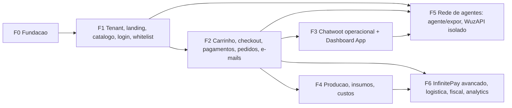

# J. Roadmap por fases

Sem prazos; estimativas relativas estão no [backlog](10-backlog.md). Não há staging ([ADR 0007](adr/0007-sem-staging-loja-modelo.md)): cada fase termina com deploy em produção atrás de feature flag, aceite verificado na **loja modelo** (`loja.muhbianco.com.br`, tenant `muhbianco`) e runbook de rollback.

## Sequência de execução (revisada em 21/09/2026)

O dono testa o produto inteiro só no fim. Por isso cada etapa entrega testes, um cenário E2E, um item no smoke pós-deploy (`infra/scripts/smoke.sh`) e o deploy atrás de flag, ligado só na loja modelo. A configuração de plataforma (criar loja, dono, status, módulos, acesso, domínios, provisionamento, agentes) fica no **admin do site** (`admin.html#lojas`); o painel da loja só opera o dia a dia (ADR 0009).

| Etapa | Conteúdo | Fase original |
|---|---|---|
| 0 | Fechamento: aceite real da loja modelo (`media smoke`, seed, `access_mode`), flags sem código desligadas, lifecycle MinIO, docs, teardown do WuzAPI na infra da empresa, domínios no admin do site, E2E base | F0/F1 |
| A | Clientes da loja: Google OIDC próprio, sessões, whitelist, aprovação no painel, OTP via `api-agents`, LGPD, loja suspensa → 503, tema por tenant | F1 fatia 2 |
| B | Chatwoot: provisionamento pelo admin do site, `liberar_loja` nos dois sentidos, reconciliação, logos | F1 fatia 3 |
| C | Domínios próprios: `providers.http`, verificação e ativação, redirects, subdomínios de plataforma | F1 fatia 4 |
| D | Catálogo completo: eventos, variantes/opções/modificadores, tags, estado `paused` ([runbook](runbooks/etapa-d-catalogo.md)) | F1 fatia 5 |
| E | Carrinho, `OrderService.place`, reservas, MP + InfinitePay, e-mails, pedidos, cupons | F2 |
| F | Chatwoot operacional + Dashboard App | F3 |
| G | Produção, insumos, custos | F4 |
| H | Rede de inteligência: assinatura multi-instância, modos "agente" e "expor", WuzAPI isolado no número do cliente ([ADR 0010](adr/0010-rede-de-agentes.md)) | F5 (substituída) |
| I | MP Connect, frete, fiscal, analytics, DNS-01/CDN, LGPD self-service, "Loja online" como serviço | F6 |
| Z | Teste do dono → correções → onboarding da Lunares e dos tenants externos | — |

**Estado da etapa D (22/09/2026)**: pronta na branch `feat/etapa-d-catalogo` (migrations `0012`–`0016`, CI verde em MariaDB), com o switch de eventos na branch `feat/etapa-d-eventos` do site. Aguarda o pedido de deploy. Ficaram fora de propósito:
- dono de mídia `event` (o evento usa as imagens do produto);
- `event_products` (o ingresso **é** o produto, e os lotes são as variantes);
- a flag `events.public_listing` (evento segue o `access_mode`).

## Fase 0 — Fundação

**Escopo**: monorepo `mucommerce` (`apps/api-commerce`, `apps/web`, `infra`, `docs`, `.github`), esqueleto FastAPI com convenções da `api-agents` + tenancy, Alembic `0001–0002`, Celery + outbox + `processed_events`, `idempotency_keys`, `audit_log`, CI (lint, testes, build, push), stack Swarm `commerce`, migrate one-shot, bootstrap MariaDB (usuários, 3306 fechada na interface pública), MinIO buckets/policy/service account, Traefik `providers.http`, Next.js esqueleto com middleware de Host, observabilidade base (logs JSON, `/healthz`, `/readyz`, Sentry, métricas), fork Chatwoot migrado (`mb/main`), Redis DBs reservados.

**Aceite**: `GET https://loja.muhbianco.com.br` responde com tenant `muhbianco` resolvido por Host; host desconhecido → 404; `painel.muhbianco.com.br/` abre o painel; `/metrics`, `/readyz` e `/api/*/internal/*` não respondem pela internet; `alembic upgrade head` + `downgrade -1` e a suíte de vazamento verdes em MariaDB no CI; `python -m app.cli outbox ping` em produção gera `outbox_deliveries` `done` + `processed_events`; imagens por sha (sem `:latest`); recuperação por snapshot da VM e drill de restore do dump manual registrado; deploy via skill `deploy` com o mapa `commerce`; Chatwoot em prod construído a partir de `muchatwoot@mb/main`.

**Estado (21/09/2026)**: a primeira passada (20/09) subiu a stack, mas deixou de fora `providers.http`, MinIO, backup, Sentry/OTel e o staging. O outbox também não entregava no worker. A "Fase 0.5" foi para produção em 21/09 (imagens `bb3b9f36912d`, serviços `commerce-*`). Aceite verificado: loja/painel 200, rotas internas 404 de fora, `outbox ping` entregue, sem `:latest`, drill de restore ok. MinIO configurado no mesmo dia (buckets `commerce-public`/`commerce-private`, policy pública só em `tenants/` e `platform/`, service account). Backup: por snapshot da VM (sem dump agendado, decisão do operador). Em aberto: Traefik `providers.http`, que fica para a fatia de domínios custom, porque ainda não há host de tenant dinâmico.

**Dependências**: acesso root MariaDB para bootstrap; alteração da stack do Traefik (janela curta, reinício do Traefik ~5 s); DNS `painel.`, `api-commerce.` e `edge.muhbianco.com.br` (A record).

**Riscos/rollback**: Traefik com provider HTTP inválido → o provider é ignorado, labels continuam; reverter a stack do Traefik é um `StackUpdate`. Fork Chatwoot: manter imagem antiga taggeada.

## Fase 1 — Tenant, landing, catálogo, domínio, login e whitelist

**Escopo**: `/ops` mínimo (criar tenant, features, domínios, associar Chatwoot account existente), provisionamento assíncrono (passos Chatwoot: account/usuário/inbox/atributos/webhook/labels), `tenant_domains` + verificação DNS + emissão TLS, settings de branding/landing/SEO (editor estruturado no painel), catálogo (produto, variante default, categorias, mídia com processamento, estoque simples com ledger e ajustes), eventos (CRUD/publicação/vínculo com produtos), vitrine e página de produto SSR, login Google (callback central + handoff), sessão, `liberar_loja` bidirecional, fluxo "solicitar acesso", OTP de telefone via `api-agents`, `access_mode` por tenant, painel do tenant (produtos, estoque, clientes/acesso, settings), auditoria dessas ações, e-mail de "acesso liberado" via n8n.

**F1 fatia 1 (21/09/2026)**: painel + catálogo + mídia + estoque + vitrine SSR em produção, com login do painel pela conta MuhBianco e lojas geridas no admin do site (ADR 0009, migration `0007`). O aceite da mídia em produção é o `media smoke` da etapa 0 ([runbook](runbooks/f1-go-live-loja-modelo.md)).

**Ordem de entrega** (fatias, cada uma atrás de flag e aceita na loja modelo antes de ligar para outro tenant): 1) painel + catálogo + mídia + estoque + vitrine SSR; 2) identidade Google + whitelist pelo painel; 3) Chatwoot (provisionamento, `liberar_loja`); 4) domínios custom + `edge.` + primeiro tenant externo (`lunares`); 5) P1 restantes.

**Aceite**: tenant `lunares` criado no painel → run de provisionamento `completed` com todos os passos (ou `failed` com retry funcional); `lunares.com.br` (ou domínio de teste) verificado por TXT+A e servido com certificado válido em ≤ 10 min após DNS; `www.` redireciona 308; landing com logo/cores/SEO/eventos; login Google em domínio de tenant cria sessão host-only; cliente sem `liberar_loja` vê "acesso pendente" e não recebe dados de catálogo (verificado por teste de API); operador marca `liberar_loja` no Chatwoot → acesso liberado em ≤ 30 s; aprovação no painel espelha no Chatwoot sem eco (testes); produto publicado aparece na vitrine com imagem processada; suíte de vazamento cobre todas as rotas da fase.

**Dependências**: Chatwoot Platform App token (Super Admin), usuário de integração, definições de atributos; Google OAuth client com `redirect_uri` central e domínios autorizados; `api-agents`: endpoint interno de OTP.

**Riscos/rollback**: Let's Encrypt rate limit em testes → domínios só entram no edge depois de verificados, e hosts de teste usam um resolver LE staging dedicado (`--certificatesresolvers.lestaging`); Chatwoot webhook perdido → reconciliação; rollback = desativar flag `storefront` do tenant (storefront volta a 404/“em breve”).

## Fase 2 — Carrinho, checkout, pagamentos, pedidos e e-mails

**Escopo**: carrinho persistente e `PricingService`, endereços, regras de retirada/entrega (zonas por CEP, taxa fixa, pedido mínimo, horário), termos com versão/consentimento, `OrderService.place` (gate único), reservas com TTL, `PaymentProvider` + `MercadoPagoProvider` (Pix + cartão via Bricks) + `InfinitePayProvider` (redirect) + `FakeProvider`, webhooks com inbox/assinatura/confirmação ativa, conciliação e expiração, máquina de estados do pedido (até `payment_confirmed`, `cancelled`, `failed`) e do pagamento, refunds MP + external, "meus pedidos" e detalhe com timeline, cancelamento pelo cliente na janela, painel de pedidos do tenant (lista, detalhe, transições operacionais, notas, reembolso), templates de e-mail por tenant e `notification_deliveries` via n8n (pedido recebido, aguardando pagamento, confirmado, cancelado, reembolso), configuração de pagamento no `/ops` com guia/links por provedor e teste de cobrança, métricas/alertas de pagamento.

**Aceite**: checkout Pix MP em sandbox na loja modelo (credenciais de teste, flag `checkout` só nela): QR exibido, pagamento confirmado por webhook em ≤ 10 s, pedido `payment_confirmed`, estoque comprometido, e-mails enviados 1×; desligar webhook → conciliação confirma em ≤ 3 min; cartão recusado → `rejected`, pedido volta a `awaiting_payment`, nova tentativa funciona; InfinitePay: link criado, retorno com query adulterada não muda estado, webhook forjado não aprova, webhook + `payment_check` verdadeiro aprova (teste com `respx`; homologação com pagamento real de R$ 1,00); 20 checkouts concorrentes para 5 unidades → 5 pedidos reservados; `Idempotency-Key` repetido devolve o mesmo pedido; todo pedido tem `order_status_history` e `audit_log`; alertas disparam em falha simulada de webhook.

**Dependências**: conta MP do tenant piloto (produção + teste), InfiniteTag do tenant, credenciais no `/ops`; n8n workflow "commerce e-mail" (clone do transacional existente) com HMAC.

**Riscos/rollback**: feature flag `checkout` por tenant (desliga compra, mantém vitrine); pagamentos em voo continuam conciliando; rollback de imagem sem downgrade de schema (migrations aditivas).

## Fase 3 — Chatwoot operacional e Dashboard App

**Escopo**: conversa por pedido na inbox Loja, atributos e labels por status, notas privadas em transições, Dashboard App "Pedido" (`/cw-app`) com transições permitidas, aprovação de acesso e link para painel; automations opcionais (`pedido-acao-*` → webhook); reconciliação Chatwoot; `api-agents`: `channel_tenant_bindings` para handoff cair na account do tenant; e-mails restantes (aceito, em preparo, pronto, enviado, entregue); CSAT opcional; cupons básicos (percentual/valor, mínimo, validade) se a fase 2 fechou no prazo.

**Aceite**: pedido criado no site aparece no Chatwoot do tenant em ≤ 30 s com atributos e label; operador avança `payment_confirmed → accepted → in_production → ready_for_pickup → delivered` pelo Dashboard App; cada clique gera `order_status_history(actor=chatwoot:email)`, e-mail ao cliente e label atualizada; transição inválida é impedida na UI e rejeitada pela API (409); loop test: atualização de atributo pela loja não gera novo evento processado; Chatwoot fora do ar por 10 min → pedidos seguem, DLQ vazia após volta; tenant sem loja não vê atributos.

**Dependências**: fase 2; token de Dashboard App por tenant; Chatwoot em `mb/main`.

**Riscos/rollback**: Dashboard App é opt-in por account (remover o app desliga a UI); labels/atributos continuam.

## Fase 4 — Estoque avançado, produção, insumos, receitas e custos

**Escopo**: fornecedores, insumos (unidades/conversões), entradas com custo médio móvel, lotes/validade opcionais, ajustes com motivo, receitas versionadas com rendimento e perdas, custo teórico, ordens de produção (planejar → iniciar → concluir/parcial) com baixa de insumos e entrada de produto acabado, `product_cost_snapshots`, snapshot de custo por item de pedido, relatórios básicos (custo por produto, variação previsto × real, desperdício, margem por pedido), alertas de estoque mínimo, variantes/modificadores completos no catálogo se ainda não entraram.

**Aceite**: receita de brownie com 5 insumos → OP de 20 unidades → concluir com consumo real ≠ previsto → movimentos `production_out` por insumo e `production_in` de 20 un com custo unitário real; `SUM(movements) == balance` para todos os itens (job de auditoria verde); pedido pago após a OP grava `unit_cost_cents_snapshot` e não muda quando um novo recebimento altera o custo médio; margem por pedido consistente no relatório; produção parcial funciona.

**Dependências**: fase 2 (pedidos) para margem; nenhuma externa.

**Riscos/rollback**: flag `manufacturing` por tenant; tabelas aditivas.

## Fase 5 (etapa H) — Rede de inteligência: agentes "agente" e "expor", WuzAPI isolado

Substitui o desenho anterior (`shared`/`owned`); decisão em [ADR 0010](adr/0010-rede-de-agentes.md).

**Escopo**:
- **`api-agents`**:
  - o mesmo serviço pode ser contratado mais de uma vez (`user_services.instance_slot`, `mode ∈ {agent, expor}`); cada instância "agente" usa um sender da empresa diferente;
  - grant "expor" por usuário no admin do site, escondido por padrão;
  - vínculo instância ↔ loja por código de uso único, com credencial por vínculo;
  - `store_gateway` como único cliente do commerce.
- **`api-commerce`**: `/internal/agent/v1` com leitura (produtos, estoque, relatórios), controle (pausar/retomar, ajuste de estoque, preço em 2 passos) e, depois da etapa E, venda (`customers/resolve`, `sales/quotes`, `sales/orders` pelo `OrderService.place`, `origin=agent_llm|agent_typebot`).
- **WuzAPI**: stack isolada, sem rota pública, só para o número **do cliente** (tabela própria `owned_whatsapp_numbers`). Denylist dos números da empresa, conferida no número declarado e no JID conectado, e kill switch.
- **Venda no "expor"**: pode ser por LLM (tools com tenant/cliente injetados pelo servidor, orçamento de tokens) ou por Typebot (`store-proxy` com token HMAC). Os dois passam pelo mesmo gate.

**Aceite**:
- Duas instâncias do mesmo agente para o mesmo usuário, com senders, KB e tools separados.
- "pausa o produto X" e "+10 no estoque" auditados como `agent:<id>`, sem aplicar duas vezes numa mensagem repetida.
- Credencial "expor" chamando controle → 403; revogada → 401.
- Número da empresa no WuzAPI → `blocked` + logout.
- Venda com produto pausado ou esgotado → recusa; mensagem duplicada → o mesmo pedido.

**Dependências**: H.1–H.3 dependem só da F1 e da etapa D. A venda (H.5) depende da etapa E. O handoff e as notificações dependem da etapa F. O go/no-go do WuzAPI é do dono, depois da apelação na Meta.

**Riscos/rollback**: flags `agents`/`agents_sales` por tenant, revogação de credencial, `WUZAPI_ENABLED=false` ou scale 0 da stack.

## Fase 6 — InfinitePay avançado, logística, fiscal, analytics/LLM e melhorias

**Escopo**: MP Connect (OAuth) e `application_fee`; frete por transportadora (`ShippingProvider`: Melhor Envio/Correios) e raio por geocodificação; NF-e/NFC-e via provedor (`TaxProvider`); camada analítica `rpt_*` + usuário read-only + tools de insight para o LLM (custo, variação, desperdício, margem, ruptura, precificação, consumo projetado); wildcard/DNS-01 e CDN quando houver API do DNS; magic link; price lists; bundles; produtos digitais/ingressos; assinaturas (avaliar); exportações LGPD self-service; SSO admin → Chatwoot (`/users/{id}/login`).

**Aceite** (por item): analytics — perguntas do LLM só tocam `rpt_*` com `tenant_id` injetado (teste de política); fiscal — NFC-e emitida em homologação para pedido pago; MP Connect — tenant conecta a conta sem colar token.

**Dependências**: contratos com provedores fiscais/logísticos; DNS API.

## Dependências entre fases

